# Database ERD Diagram

## Entity Relationship Diagram

```mermaid
erDiagram
    %% Core Business Entities
    User {
        int id PK
        string username UK
        string password
        string email UK
        string phone
        boolean isActive
        datetime lastLoginAt
        datetime createdAt
        datetime updatedAt
        int storeId FK
        enum role
    }

    Store {
        int id PK
        string name
        string code UK
        string address
        string phone
        string email
        boolean isActive
        string region
        string managerName
        datetime createdAt
        datetime updatedAt
    }

    Customer {
        int id PK
        string name
        string kana
        string phone
        string email
        string note
        string customerCode UK
        date birthDate
        string address
        boolean isActive
        datetime createdAt
        datetime updatedAt
    }

    Order {
        int id PK
        int storeId FK
        int customerId FK
        int planId FK
        int statusId FK
        datetime receptionDate
        datetime expectedStoreArrivalDate
        int pickupMethodId FK
        decimal salesPrice
        string orderNo UK
        string notes
        enum priority
        datetime estimatedCompletionDate
        datetime actualCompletionDate
        boolean isUrgent
        string internalNotes
        int createdBy FK
        int updatedBy FK
        datetime createdAt
        datetime updatedAt
    }

    OrderItem {
        int id PK
        int orderId FK
        int itemTypeId FK
        int staffId FK
        int quantity
        decimal unitPrice
        datetime orderPeriodStart
        datetime orderPeriodEnd
    }

    %% Master Data Tables
    MCode {
        int id PK
        string category
        string code
        string name
        string description
        int sortOrder
        boolean isActive
        json metadata
        datetime createdAt
        datetime updatedAt
    }

    ItemType {
        int id PK
        string code UK
        string name
        int mCodeId FK
    }

    Plan {
        int id PK
        string code UK
        string name
        int mCodeId FK
    }

    PickupMethod {
        int id PK
        string code UK
        string name
        int mCodeId FK
    }

    OrderStatus {
        int id PK
        string name UK
        string code UK
        string description
        boolean isActive
        int sortOrder
        string color
    }

    %% Unified Master Tables
    PatternMaster {
        int id PK
        int itemTypeId FK
        string patternNo UK
        string size
        decimal length
        decimal shoulderWidth
        decimal bust
        decimal waist
        decimal hip
        decimal sleeveLength
        decimal sleeveWidth
        decimal lapelWidth
        decimal crotchWidth
        decimal kneeWidth
        decimal hemWidth
        decimal rise
        decimal inseam
        string stitchSpec
        string liningSpec
        int defaultButtonCount
        boolean isActive
        datetime createdAt
        datetime updatedAt
    }

    MeasurementType {
        int id PK
        int itemTypeId FK
        string code UK
        string name
        string unit
        boolean isActive
        int sortOrder
        datetime createdAt
        datetime updatedAt
    }

    %% Product Details
    JacketDetails {
        int orderItemId PK
        int fabricId FK
        string fabricNo
        int patternId FK
        string patternNo
        int bodyLiningId FK
        string bodyLiningNo
        string bodyLiningColorNo
        int bodyLiningOrientationId FK
        int sleeveLiningId FK
        string sleeveLiningNo
        string sleeveLiningColorNo
        int sleeveLiningOrientationId FK
        string liningSpec
        int buttonId FK
        string buttonNo
        string buttonColorNo
        int optionsId FK
        string optionsText
        string cuffSpec
        int cuffButtonCount
        decimal cuffButtonStartPos
        string sizeLabel
        boolean bastedFitting
        string remarks
    }

    CoatDetails {
        int orderItemId PK
        int seasonId FK
        int supplierId FK
        int fabricId FK
        string fabricNo
        int patternId FK
        string patternNo
        int bodyLiningId FK
        string bodyLiningNo
        string bodyLiningColorNo
        int bodyLiningOrientationId FK
        int sleeveLiningId FK
        string sleeveLiningNo
        string sleeveLiningColorNo
        int sleeveLiningOrientationId FK
        string liningSpec
        int buttonId FK
        string buttonNo
        string buttonColorNo
        int optionsId FK
        string optionsText
        string cuffSpec
        int cuffButtonCount
        decimal cuffButtonStartPos
        string sizeLabel
        boolean bastedFitting
        string remarks
    }

    SuitDetails {
        int orderItemId PK
        int seasonId FK
        int supplierId FK
        int fabricId FK
        string fabricNo
        int jacketPatternId FK
        string jacketPatternNo
        int pantsPatternId FK
        string pantsPatternNo
        int bodyLiningId FK
        string bodyLiningNo
        string bodyLiningColorNo
        int bodyLiningOrientationId FK
        int sleeveLiningId FK
        string sleeveLiningNo
        string sleeveLiningColorNo
        int sleeveLiningOrientationId FK
        string liningSpec
        int jacketButtonId FK
        string jacketButtonNo
        string jacketButtonColorNo
        int pantsButtonId FK
        string pantsButtonNo
        string pantsButtonColorNo
        int optionsId FK
        string cuffSpec
        int cuffButtonCount
        decimal cuffButtonStartPos
        string jacketSizeLabel
        string pantsSizeLabel
        string pantsHemSpec
        decimal pantsDoubleWidth
        boolean bastedFitting
        string remarks
    }

    PantsDetails {
        int orderItemId PK
        int seasonId FK
        int supplierId FK
        int fabricId FK
        string fabricNo
        int patternId FK
        string pantsPatternNo
        string liningSpec
        int buttonId FK
        string pantsButtonNo
        string pantsButtonColorNo
        int optionsId FK
        string pantsSizeLabel
        string pantsHemSpec
        decimal pantsDoubleWidth
        boolean bastedFitting
        string remarks
    }

    VestDetails {
        int orderItemId PK
        int seasonId FK
        int supplierId FK
        int fabricId FK
        string fabricNo
        int patternId FK
        string patternNo
        int bodyLiningId FK
        string bodyLiningNo
        string bodyLiningColorNo
        int bodyLiningOrientationId FK
        string liningSpec
        int buttonId FK
        string buttonNo
        string buttonColorNo
        int optionsId FK
        string sizeLabel
        boolean bastedFitting
        string remarks
    }

    %% Master Data
    HeavyFabricMaster {
        int id PK
        string supplierNo
        string fabricMaker
        string fabricNo UK
        string color
        string pattern
        string composition
        string characteristics
        decimal fairFabricUnitPrice
        string fairFabricRank
        decimal regularFabricUnitPrice
        string regularFabricRank
        datetime dataUpdated
        boolean largePattern
        boolean transparent
        boolean stockFlag
        int supplierId FK
        int createdBy FK
        int updatedBy FK
        datetime createdAt
        datetime updatedAt
    }

    Supplier {
        int id PK
        string code
        string name
        string contactEmail
        string contactPhone
        string note
        int mCodeId FK
    }

    Season {
        int id PK
        string code UK
        string name
        int mCodeId FK
    }

    OrientationType {
        int id PK
        string code UK
        string name
        int mCodeId FK
    }

    BodyLiningMaster {
        int id PK
        string productNo UK
        string colorNo
        string orientation
        boolean stockFlag
    }

    SleeveLiningMaster {
        int id PK
        string productNo UK
        string colorNo
        string orientation
        boolean stockFlag
    }

    HeavyFabricButtonMaster {
        int id PK
        string productNo
        string colorNo
        string pantsProductNo
        string pantsColorNo
        decimal cost1
        decimal cost2
        decimal cost3
        decimal cost4
        decimal cost5
        decimal cost6
        decimal cost7
        decimal cost8
        decimal retailPrice1
        decimal retailPrice2
        decimal retailPrice3
        decimal retailPrice4
        decimal retailPrice5
        decimal retailPrice6
        decimal retailPrice7
        decimal retailPrice8
    }

    OptionMaster {
        int id PK
        string optionName
        decimal cost
        decimal retailPrice
        string textContent
    }

    %% Measurement Tables
    JacketMeasurement {
        int id PK
        int orderItemId FK
        int typeId FK
        decimal standardValue
        decimal adjustValue
        decimal finalValue
    }

    CoatMeasurement {
        int id PK
        int orderItemId FK
        int typeId FK
        decimal standardValue
        decimal adjustValue
        decimal finalValue
    }

    SuitJacketMeasurement {
        int id PK
        int orderItemId FK
        int typeId FK
        decimal standardValue
        decimal adjustValue
        decimal finalValue
    }

    SuitPantsMeasurement {
        int id PK
        int orderItemId FK
        int typeId FK
        decimal standardValue
        decimal adjustValue
        decimal finalValue
    }

    PantsMeasurement {
        int id PK
        int orderItemId FK
        int typeId FK
        decimal standardValue
        decimal adjustValue
        decimal finalValue
    }

    VestMeasurement {
        int id PK
        int orderItemId FK
        int typeId FK
        decimal standardValue
        decimal adjustValue
        decimal finalValue
    }

    %% System Tables
    OrderLog {
        int id PK
        int orderId FK
        int userId FK
        int statusId FK
        string action
        string description
        json oldValues
        json newValues
        datetime createdAt
    }

    Document {
        int id PK
        int orderId FK
        enum type
        string fileName
        string filePath
        int fileSize
        datetime generatedAt
        int generatedBy
    }

    Notification {
        int id PK
        int userId FK
        string title
        string message
        enum type
        boolean isRead
        json data
        datetime createdAt
        datetime readAt
    }

    SystemConfig {
        int id PK
        string key UK
        string value
        string description
        boolean isActive
        datetime updatedAt
    }

    Staff {
        int id PK
        int storeId FK
        string name
        string email
        string phone
        string role
    }

    %% Relationships
    User ||--o{ Order : "creates"
    User ||--o{ Order : "updates"
    User }o--|| Store : "belongs to"
    User ||--o{ OrderLog : "performs"
    User ||--o{ Notification : "receives"

    Store ||--o{ Order : "has"
    Store ||--o{ User : "employs"
    Store ||--o{ Staff : "employs"

    Customer ||--o{ Order : "places"

    Order ||--o{ OrderItem : "contains"
    Order ||--o{ OrderLog : "tracks"
    Order ||--o{ Document : "generates"

    OrderItem ||--o| JacketDetails : "has"
    OrderItem ||--o| CoatDetails : "has"
    OrderItem ||--o| SuitDetails : "has"
    OrderItem ||--o| PantsDetails : "has"
    OrderItem ||--o| VestDetails : "has"
    OrderItem }o--|| ItemType : "is of type"
    OrderItem }o--|| Staff : "assigned to"

    ItemType ||--o{ PatternMaster : "has patterns"
    ItemType ||--o{ MeasurementType : "has measurements"
    ItemType }o--|| MCode : "categorized by"

    Plan }o--|| MCode : "categorized by"
    PickupMethod }o--|| MCode : "categorized by"
    Season }o--|| MCode : "categorized by"
    Supplier }o--|| MCode : "categorized by"
    OrientationType }o--|| MCode : "categorized by"

    Order }o--|| Plan : "uses"
    Order }o--|| PickupMethod : "uses"
    Order }o--|| OrderStatus : "has status"

    PatternMaster }o--|| ItemType : "belongs to"

    MeasurementType }o--|| ItemType : "belongs to"

    JacketDetails }o--|| HeavyFabricMaster : "uses fabric"
    JacketDetails }o--|| PatternMaster : "uses pattern"
    JacketDetails }o--|| BodyLiningMaster : "uses lining"
    JacketDetails }o--|| SleeveLiningMaster : "uses sleeve lining"
    JacketDetails }o--|| HeavyFabricButtonMaster : "uses button"
    JacketDetails }o--|| OptionMaster : "uses option"
    JacketDetails }o--|| OrientationType : "uses orientation"

    CoatDetails }o--|| HeavyFabricMaster : "uses fabric"
    CoatDetails }o--|| PatternMaster : "uses pattern"
    CoatDetails }o--|| BodyLiningMaster : "uses lining"
    CoatDetails }o--|| SleeveLiningMaster : "uses sleeve lining"
    CoatDetails }o--|| HeavyFabricButtonMaster : "uses button"
    CoatDetails }o--|| OptionMaster : "uses option"
    CoatDetails }o--|| Season : "for season"
    CoatDetails }o--|| Supplier : "from supplier"
    CoatDetails }o--|| OrientationType : "uses orientation"

    SuitDetails }o--|| HeavyFabricMaster : "uses fabric"
    SuitDetails }o--|| PatternMaster : "uses jacket pattern"
    SuitDetails }o--|| PatternMaster : "uses pants pattern"
    SuitDetails }o--|| BodyLiningMaster : "uses lining"
    SuitDetails }o--|| SleeveLiningMaster : "uses sleeve lining"
    SuitDetails }o--|| HeavyFabricButtonMaster : "uses jacket button"
    SuitDetails }o--|| HeavyFabricButtonMaster : "uses pants button"
    SuitDetails }o--|| OptionMaster : "uses option"
    SuitDetails }o--|| Season : "for season"
    SuitDetails }o--|| Supplier : "from supplier"
    SuitDetails }o--|| OrientationType : "uses orientation"

    PantsDetails }o--|| HeavyFabricMaster : "uses fabric"
    PantsDetails }o--|| PatternMaster : "uses pattern"
    PantsDetails }o--|| HeavyFabricButtonMaster : "uses button"
    PantsDetails }o--|| OptionMaster : "uses option"
    PantsDetails }o--|| Season : "for season"
    PantsDetails }o--|| Supplier : "from supplier"

    VestDetails }o--|| HeavyFabricMaster : "uses fabric"
    VestDetails }o--|| PatternMaster : "uses pattern"
    VestDetails }o--|| BodyLiningMaster : "uses lining"
    VestDetails }o--|| HeavyFabricButtonMaster : "uses button"
    VestDetails }o--|| OptionMaster : "uses option"
    VestDetails }o--|| Season : "for season"
    VestDetails }o--|| Supplier : "from supplier"
    VestDetails }o--|| OrientationType : "uses orientation"

    HeavyFabricMaster }o--|| Supplier : "from supplier"

    JacketDetails ||--o{ JacketMeasurement : "has measurements"
    CoatDetails ||--o{ CoatMeasurement : "has measurements"
    SuitDetails ||--o{ SuitJacketMeasurement : "has jacket measurements"
    SuitDetails ||--o{ SuitPantsMeasurement : "has pants measurements"
    PantsDetails ||--o{ PantsMeasurement : "has measurements"
    VestDetails ||--o{ VestMeasurement : "has measurements"

    JacketMeasurement }o--|| MeasurementType : "of type"
    CoatMeasurement }o--|| MeasurementType : "of type"
    SuitJacketMeasurement }o--|| MeasurementType : "of type"
    SuitPantsMeasurement }o--|| MeasurementType : "of type"
    PantsMeasurement }o--|| MeasurementType : "of type"
    VestMeasurement }o--|| MeasurementType : "of type"
```

## Key Improvements Highlighted

### 🎯 **Unified Master Tables**

- **PatternMaster**: Consolidates all pattern data (Jacket, Coat, Suit, Vest, Pants)
- **MeasurementType**: Centralizes measurement type definitions
- **MCode**: Manages all code values in one place

### 🔗 **Enhanced Relationships**

- **Foreign Key Constraints**: All relationships properly defined
- **Audit Trail**: Complete tracking with createdBy/updatedBy
- **Data Integrity**: Check constraints for validation

### 📊 **Performance Optimizations**

- **Composite Indexes**: Strategic indexing for common queries
- **Normalized Structure**: Reduced data duplication
- **Efficient Joins**: Optimized relationship design

### 🛡️ **Data Validation**

- **Check Constraints**: Database-level validation
- **Referential Integrity**: Foreign key constraints
- **Soft Deletes**: isActive flags for data retention

## Database Statistics

- **Total Tables**: 35+
- **Core Entities**: 8 (User, Store, Customer, Order, OrderItem, etc.)
- **Master Data**: 15+ (Patterns, Measurements, Fabrics, etc.)
- **System Tables**: 5 (Logs, Documents, Notifications, etc.)
- **Relationships**: 50+ foreign key relationships
- **Indexes**: 20+ performance indexes
